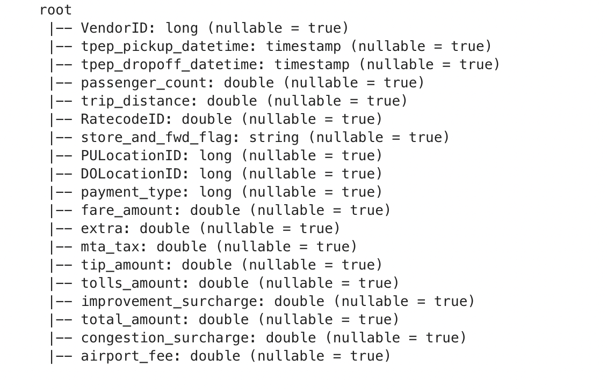
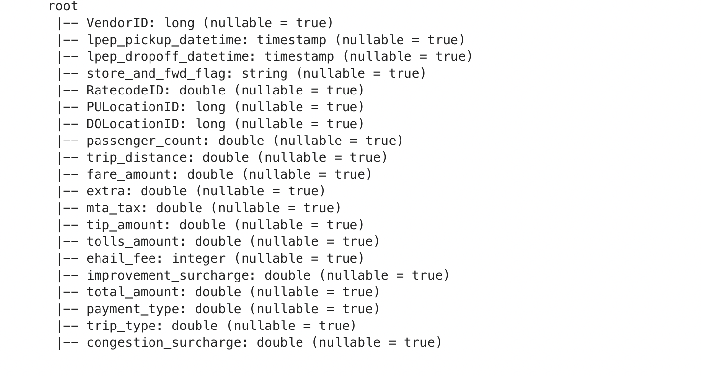
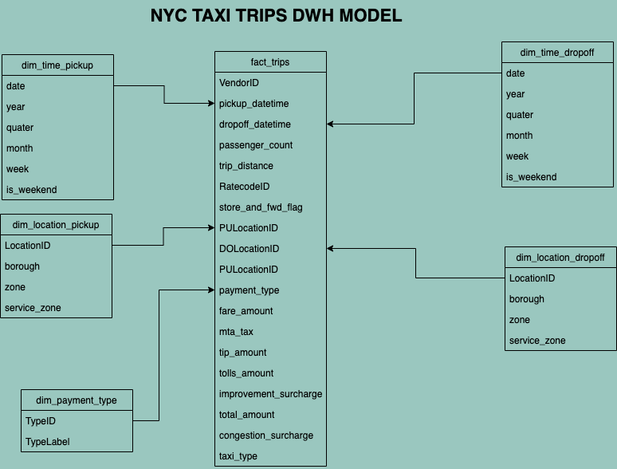
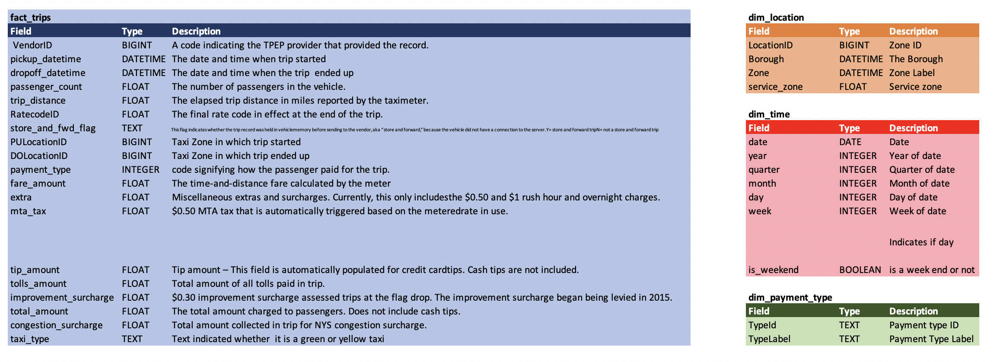

# Udacity Data Engineering Capstone Project - by KONE AZIZ R.

The project follows steps below 
<ul>
    <li>Step 1: Scope the Project and Gather Data </li>
    <li>Step 2: Explore and Assess the Data</li>
    <li>Step 3: Define the Data Model</li>
    <li>Step 4: Run ETL to Model the Data</li>
    <li>Step 5: Complete Project Write Up</li>
</ul>
 
    

## Step 1: Scope the Project and Gather Data

The purpose of the data engineering capstone project is to combine all the data engineering skills we have learned during the Udacity Data Engineering Journey.

In particular
	- Data modeling
	- Building Data Lake in AWS S3
	- Creating Data Warehouse within AWS Redshift
	- Building ETL Pipelines orchestrating by Apache Airflow.

In this project, we will be working with 3 datasets:

#### The New york city Yellow Taxi Data which contains trips record for the famous yellow taxi
    
Trips made by New York City’s iconic yellow taxis have been recorded and provided to the TLC since 2009. 
Yellow taxis are traditionally hailed by signaling to a driver who is on duty and seeking
a passenger (street hail), but now they may also be hailed using an e-hail app like Curb or Arro.
Yellow taxis are the only vehicles permitted to respond to a street hail from a passenger in all five
boroughs. 

#### The New york city Green Taxi Data which contains trips record for green taxi

Green taxis, also known as boro taxis and street-hail liveries, were introduced in August of 2013 to improve taxi service and availability in the
boroughs. 
Green taxis may respond to street hails,but only in the areas indicated in green on the map (i.e. above W 110 St/E 96th St in Manhattan
and in the boroughs). Records include fields capturing pick-up and drop-off dates/times, pick-up and drop-off locations, trip distances, itemizedfares, rate types, payment types, and driver-reported passenger counts. 

#### The Taxi zone lookup containing the new york city zone information
   
Each of the trip records contains a field corresponding to the location of the pickup or drop-off ofthe trip, populated by numbers ranging from 1-263. These numbers correspond to taxi zones.

All these data sources can be found here : https://www.nyc.gov/site/tlc/about/tlc-trip-record-data.page stored as parquet files from year 2009 to 2022 by month.

With the datawarehouse we will build, we want to be able to answer the questions below:

. How many trips we have by day and by type of taxi ? 
. How many trips we have by day and by drop in location or drop off ?
. How many trips we have by taxi type and drop in or drop off location ?
. How many trips we have by payment type ?
. What is the average amount for each taxi type ?
. What is the average/max/min miles covered for each type of taxi  ?

## Step 2: Explore and Assess the Data

The most principles data are yellow taxi trips and green taxi trips.
They have note exactly the same schema but they have much columns in common.

<b>Yellow trips schema</b>

<b>Green trips schema</b>

The goal here is to merge these 2 tables into one.

So we first rename some columns having same informations on both tables to make them the same name.
Following this concept, tpep_pickup_datetime and lpep_pickup_datetime become pickup_datetime.
tpep_dropoff_datetime, lpep_dropoff_datetime become dropoff_datetime the same way.
We also add a new column to distinguish yellow records form green records.

    After the merging, we can see that there is a payment_type column with numeric values.
    We can see their matching label via this dictionnary https://www1.nyc.gov/assets/tlc/downloads/pdf/data_dictionary_trip_records_yellow.pdf

## Step 3: Define the Data Model
Our datawarehouse is a star schema composed of 1 fact table for trips record and 3 dimension tables.

1. fact_trips
2. dim_location
3. dim_time
4. dim_payment_type

Actually, a trip is related to dim_location twice. First as pickup location and drop off location.
dim_time has the same behaviour. These two dimensions are the so called role play dimensions.
After creating the reals tables dim_location and dim_time, we need to create view to reference them and then associate those views to the fact_trips table.

Corresponding Dictionnary are found here 

## Step 4: Run ETL to Model the Data
here are the steps of the ETL process

* Yellow taxi trips source can be found at  https://d37ci6vzurychx.cloudfront.net/trip-data/yellow_tripdata_<b>YEAR</b>-<b>MONTH</b>.parquet where <b>YEAR</b> and <b>MONTH</b> represent the period.

* Green taxi trips are stored here https://d37ci6vzurychx.cloudfront.net/trip-data/green_tripdata_<b>YEAR</b>-<b>MONTH</b>.parquet where <b>YEAR</b> and <b>MONTH</b> represent the period.

* The first step of our pipeline is to start downloading yellow and green trips for a given month and year .
* We then load them in Spark as we will do for taxi zone lookup.
* After that, fact and dimension tables are created and finally populated 

## Step 5: Complete Project Write Up

This project has been inplemented on only one month of data.
We could use Apache Airflow to continuously integrate our data every end of month.
To preserve some disk space, we could remove files that has been integrated.

As data can be grow quickly, there are some specific questions we need to answer:

**What if data was increased by 100x ?**  
For reading purpose: As data is increasing, we can scale our local spark ou simply use Amazon Elastic Map Reduce.  
For writing purpose: We are using Amazon Redshift which is highly scalable. It has good performance supporting petabytes of data.

**The database needed to be accessed by 100+ people**  
As we are already using AWS Redshift, we can take advantage of his strentgh such as querying speed optimization and fast scaling.
All those can be done With low costs.  

**The pipelines would be run on a daily basis by 7 am every day**  
This question is not applicable in our case as our data are available each month but suppose that the nyc taxi data can be accessed on daily mode.
The process define along this project will be wrap up in an airflow dag.
Exactly, one cron will be responsible of data gathering from nyc source and save them into an AWS S3 bucket.
From S3, we will apply the following: data cleaning, data transformation and data integration. 

## Conclusion
All the data processing has been done in **de_notebook.ipynb** file.  

SQL queries for tables and views creation are here **sql_queries.py**